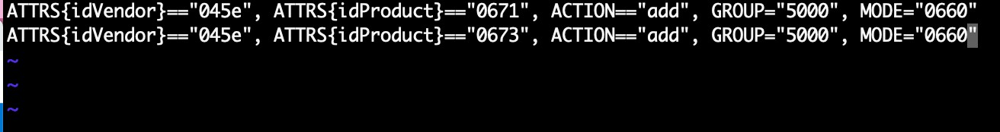

# content-speak-with-azure-percept-vision-audio
The goal of this project is to be able to use Azure Percept Audio to speak the content that Azure Percept Vision sees.

## Solution Architecture


## Prerequsite
- Install [VS Code](https://code.visualstudio.com/)
- Install [Git](https://git-scm.com/)
- Install the [IoT Hub Extension](https://marketplace.visualstudio.com/items?itemName=vsciot-vscode.azure-iot-toolkit) in VS Code
- Install the Azure [IoT Tools Extension](https://marketplace.visualstudio.com/items?itemName=vsciot-vscode.azure-iot-tools) in VS Code
- Speaker or headphones that can connect to a 3.5-mm audio jack

## Content

| File             | Description                                                   |
|-------------------------|---------------------------------------------------------------|
| `readme.md`             | This readme file                                              |
| `deployment.EarSomSpeechModule.template.json`    | The delopyment the edge modules of this content speaking Solution |
| `envtemplate`    | The list of the enviroment varialbes for .env use |

### Step 0: Clone this repository

1. Open your terminal or cmd and execute the command below
   
    ```
    git clone https://github.com/leannhuang/content-speak-with-azure-percept-vision-audio.git
    ```

### Step 1: Create a Azure Container Registry

1. Create a [Azure Container Registry](https://docs.microsoft.com/en-us/azure/container-registry/container-registry-get-started-portal#create-a-container-registry)
2. [Enable admin account](https://docs.microsoft.com/en-us/azure/container-registry/container-registry-tutorial-prepare-registry#enable-admin-account) and note down `Username`, `Login server` and `password`

### Step 2: Provide values for all variables in .env

1. Rename `envtemplate` to `.env`
    
    
2. Open the file and fill in the following details  
    
   1. CONTAINER_REGISTRY_USERNAME_yourregistryname
   2. CONTAINER_REGISTRY_PASSWORD_yourregistryname
   3. CONNECTION_STRING (check [here](https://github.com/leannhuang/voice-control-inventory-management#get-your-iot-hub-connection-string) to get your connection string)
   4. DEVICE_ID (go to your IoT Edge Devices in the IoT Hub to get your device id)
    
    

### Step 3: Deploy modules on your edge device

1. Fill your Azure Container Registry Login server address in `module.json` file in the InvokeModule folder (ex: "repository": "rgleannmaria.azurecr.io/invokemodule")
```
   "repository": "<Your container registry login server>/invokemodule"
```

2. Build and push your IoT Edge solutions to your private ACR 
   1. Sign in to Docker
      1. Open the Visual Studio Code integrated terminal by selecting `View` > `Terminal`.
      2. Sign in to Docker with the Azure Container registry credentials that you saved after creating the registry.
            ```
                docker login -u <ACR username> -p <ACR password> <ACR login server>
            ```
   2. Build and Push
      1. Select your target architecture. Open the command palette and search for `Azure IoT Edge: Set Default Target Platform for Edge Solution`. In the promoted window, select `arm64v8`.
        
        
      2. In the Visual Studio Code explorer, right-click the `deployment.EarSomSpeechModule.template.json` file and select `Build and Push IoT Edge Solution`.
         
   

3. Deploy edge modules to device
   1. Right-click the `deployment.EarSomSpeechModule.arm64v8` under a newly created `config` folder, then select `Create Deployment for Single Device`.
        
         

   2. Under your device, expand Modules to see a list of deployed and running modules. Click the refresh button. You should see the new SimulatedTemperatureSensor and SampleModule modules running on your device.
        
         
    
    It may take a few minutes for the modules to start. The IoT Edge runtime needs to receive its new deployment manifest, pull down the module images from the container runtime, then start each new module.

### Step 4: Grant the speech module permission to access Ear SoM

  1. Open terminal and SSH to your device 
   
        ```
        ssh usrname@ip
        ```

  2. Add udev rules

          

      1. Execute command to edit the 99-azureearsomaccess.rules file
            ```
            sudo vim /etc/udev/rules.d/99-azureearsomaccess.rules
            ```
      2. Add content below
            ```
            ATTRS{idVendor}=="045e", ATTRS{idProduct}=="0671", ACTION=="add", GROUP="5000", MODE="0660"
            ATTRS{idVendor}=="045e", ATTRS{idProduct}=="0673", ACTION=="add", GROUP="5000", MODE="0660"
            ```

              
       
      3. Use command `:wq` to end the file editing

  3. Reload udev rules config by executing the command below.    
  
        ```
        sudo udevadm control --reload-rules
        sudo udevadm trigger
        ```
  4. Remove and plug Ear SoM.

### Step 5: Create or replace your object detection model and deploy it to DK [here](https://docs.microsoft.com/en-us/azure/azure-percept/tutorial-nocode-vision) (the default model is people detection model)  


Now you are ready to use Azure Percept Audio to speak the content that Azure Percept Vision sees. 

### Troubleshooting
1. Install [VLC](https://www.videolan.org/) and open a browser to enter the url `rtsp://ip:8554/result` to view the rtsp stream 
     
   
2. Check the logs EarSomSpeechModule and InvokeModule from IoT Hub 
     

     

3. Remove and plug Ear SoM again if you can not hear the sound from Percept Audio

### Credits and references
- [Tutorial: Develop IoT Edge modules with Linux containers](https://docs.microsoft.com/en-us/azure/iot-edge/tutorial-develop-for-linux?view=iotedge-2020-11)
